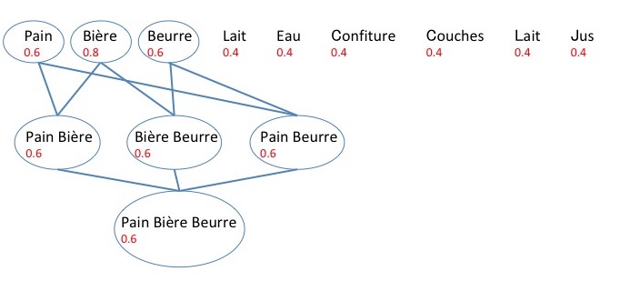

#Exercice I

##Question 1

Pour trouver les itemsets fréquents, avec un support minimal de 0.6, on calcule d'abord les supports des 1-itemsets. On fusionnera ensuite les 1-itemsets respectant le critère. Ensuite, on fusionnera les k-itemsets ayant k-1 items et respectant le critère du support minimal, jusqu'à ce qu'on ne trouve plus d'itemsets fréquents.

Le support sera calculé de la manière suivante: $\frac{\sigma(itemset)}{N}$ avec N étant égal à 5.

Par exemple pour l'itemset "Pain": $s(Pain)=\frac{3}{5}=0.6$

Les supports de itemsets fréquents sont réprésentés dans un graphe avec les itemsets fréquents entourés . Les valeurs du support sont indiquées en rouge.

Les itemsets fréquents sont donc: "Pain", "Bière", "Beurre", "Pain Bière", "Bière Beurre", "Pain Beurre" et "Pain Bière Beurre".

##Question 2

Parmi les itemsets fréquents, on cherche à déterminer les règles d'associations avec une confiance minimale de 0.7. De plus, on cherche les règles de la forme ${item_1}\rightarrow {item_2,item_3}$.

Parmi les itemsets fréquents obtenus, on remarque que les règles d'associations possibles de la forme sus-mentionnée sont $Pain\rightarrow Bière,Beurre$ ; $Bière\rightarrow Pain,Beurre$ ; $Beurre\rightarrow Pain,Bière$.

On calcule les confiances pour ces itemsets:

\begin{itemize}
\item $c(Pain\rightarrow Bière,Beurre)=\frac{\sigma(Pain,Bière,Beurre)}{\sigma(Pain)}=\frac{0.6}{0.6}=1$
\item $c(Bière\rightarrow Pain,Beurre)=\frac{\sigma(Bière,Pain,Beurre)}{\sigma(Bière)}=\frac{0.6}{0.8}=0.75$
\item $c(Beurre\rightarrow Pain,Bière)=\frac{\sigma(Beurre,Pain,Bière)}{\sigma(Beurre)}=\frac{0.6}{0.6}=1$
\end{itemize}

Les règles d'associations trouvées sont donc les suivantes: $Pain\rightarrow Bière,Beurre$ ; $Bière\rightarrow Pain,Beurre$ ; $Beurre\rightarrow Pain,Bière$

##Question 3

Maintenant, nous cherchons les règles d'associations avec une confiance minimale de 1.
D'après les résultats de la question précédente, on trouve que les règles d'associations respectant ce critère sont les deux règles suivantes: $Pain\rightarrow Bière,Beurre$ et $Beurre\rightarrow Pain,Bière$
